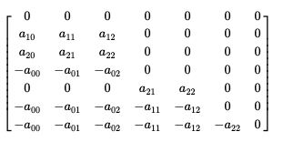

## Symbolic, exact and division-free computation algorithms for the determinant and the characteristic polynomial ##

### Explicit Matrix power method for the Clow-based algorithm ###
If we follow the Dynamic Programming approach of the clow-based method, we obtain a simple expression for the determinant and all the coefficients of the charasteristic polynomial.

with

where M is matrix is the 'transition matrix' of the dynamic algorithm as described in [Rote], s corresponds to the initial conditions and r to the final collecting node.

For n=3 we have:

and M is:

### References ###
- [Meena Bhaskar Mahajan, V Vinay, Determinant: Combinatorics, algorithms, and complexity. Chicago J. Theor. Comput. Sci., Vol. 1997, Article no. 1997-5, 26 pp.](https://eccc.weizmann.ac.il/eccc-reports/1997/TR97-036/index.html)
- [Mahajan M., Vinay V. (1998) Determinant: Old algorithms, new insights. In: Arnborg S., Ivansson L. (eds) Algorithm Theory — SWAT'98. SWAT 1998. Lecture Notes in Computer Science, vol 1432. Springer, Berlin, Heidelberg.](https://doi.org/10.1007/BFb0054375)
- [Rote G. (2001) Division-Free Algorithms for the Determinant and the Pfaffian: Algebraic and Combinatorial Approaches. In: Alt H. (eds) Computational Discrete Mathematics. Lecture Notes in Computer Science, vol 2122. Springer, Berlin, Heidelberg.](https://doi.org/10.1007/3-540-45506-X_9)
